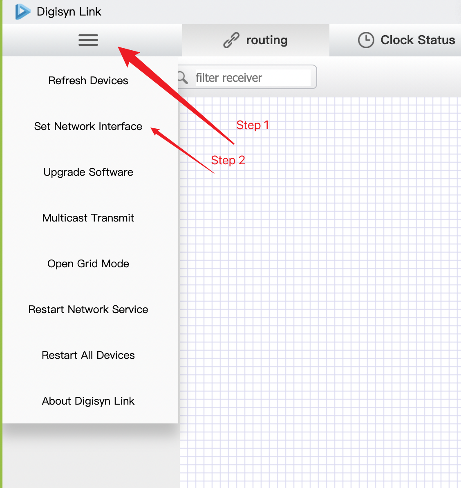
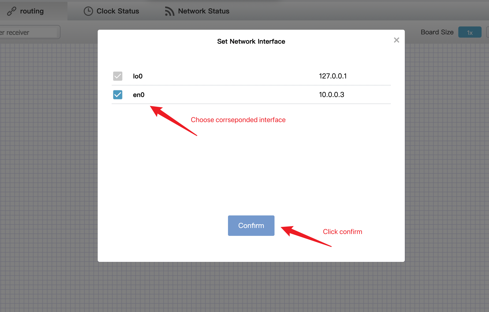

If you cannot find device when using our DigiSyn Link GUI Software, it is probably you are on the wrong interface. This tutorial is to show how to change to the right interface.

## Steps

1. After GUI start up navigate to the options -> Set network interface: 

2.  Choose corresponded Interface on the panel shown, and confirm. 

3. It may take a while for settings to be effective, and then you should see devices online. 